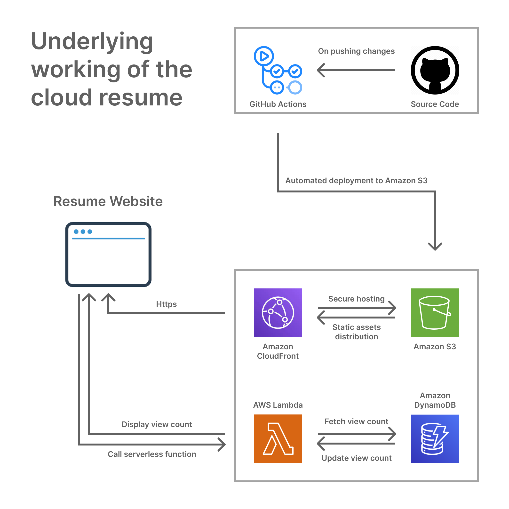

# My Cloud Resume

Checkout my resume [here](https://d1ysioknval91e.cloudfront.net)

## Overview

Welcome to my Cloud Resume! This simple solo project showcases my skills in serverless architecture using AWS services like AWS Lambda, DynamoDB, S3, and CloudFront. The resume website is deployed and hosted automatically using GitHub Actions.

## Table of Contents

- [Architecture Overview](#architecture-overview)
- [Technologies Used](#technologies-used)
- [Setup Instructions](#setup-instructions)
- [GitHub Actions Workflow](#github-actions-workflow)
- [Continuous Deployment](#continuous-deployment)
- [How It Works](#how-it-works)
  - [View Count](#view-count)
  - [Serverless in the Cloud](#serverless-in-the-cloud)
  - [GitHub Actions Deployment](#github-actions-deployment)
- [Conclusion](#conclusion)

## Architecture Overview

The cloud resume utilizes serverless architecture, leveraging AWS Lambda for dynamic content, DynamoDB for data storage, S3 for static assets as well as static hosting, and CloudFront for global distribution. GitHub Actions automates the deployment process, ensuring rapid and efficient updates to the resume website.

## Technologies Used

- **Frontend:** HTML, CSS, JavaScript
- **Serverless Components:**
  - [AWS Lambda](https://aws.amazon.com/lambda/): Executes server-side logic for dynamic content.
  - [Amazon DynamoDB](https://aws.amazon.com/dynamodb/): Serverless NoSQL database for data storage.
- **Cloud Services:**
  - [Amazon S3](https://aws.amazon.com/s3/): Object storage for hosting static website files.
  - [Amazon CloudFront](https://aws.amazon.com/cloudfront/): Content delivery network for global distribution.
- **Automation:**
  - [GitHub Actions](https://github.com/features/actions): Automates the deployment workflow.
- **Testing:**
  - [Jest](https://jestjs.io/): Used for website testing.

## Setup Instructions

1. Clone the repository: `git clone https://github.com/khairalanam/my-cloud-resume`
2. Navigate to the project directory: `cd my-cloud-resume`
3. Install the dependencies by running `npm install`
4. Render the website manually or by using a VS Code extension like Live Server.
5. For testing the website, run `npm run test`

## GitHub Actions Workflow

The GitHub Actions workflow is defined in the `.github/workflows` directory. It automatically triggers on pushes to the `main` branch and deploys the updated website along with running the unit tests.

## Continuous Deployment

Continuous deployment is achieved through GitHub Actions. The workflow installs dependencies, builds the website, and deploys it to AWS S3 and Lambda functions.

## How It Works

### View Count

The view count is tracked using a DynamoDB table. Each visit increments the count, providing insights into the view count of the resume.

### Serverless in the Cloud

The serverless architecture allows the resume to scale dynamically based on demand, with AWS Lambda handling compute resources automatically.

### GitHub Actions Deployment

GitHub Actions automates the deployment and testing processes, executing a series of steps to ensure the latest changes are reflected in the live website.

## Conclusion

Thank you for exploring my Cloud Resume! This project allowed me to delve into the realms of serverless architecture and cloud technologies.

**Why Serverless?**  
I wanted to try out the serverless architecture and observe the benefits of scalability and efficieny. The architecture ensures that the website responds dynamically to user interactions, providing a smooth and responsive experience.

**Continuous Improvement**  
GitHub Actions streamlines the deployment process, enabling quick updates to reflect the latest additions to my professional resume. This means that many of the manual work of testing and deploying are automated using GitHub Actions.

Feel free to connect with me on [LinkedIn](www.linkedin.com/in/khair-alanam) or [Twitter](https://twitter.com/khair_alanam).

Thank you for visiting!
